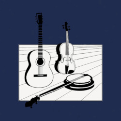
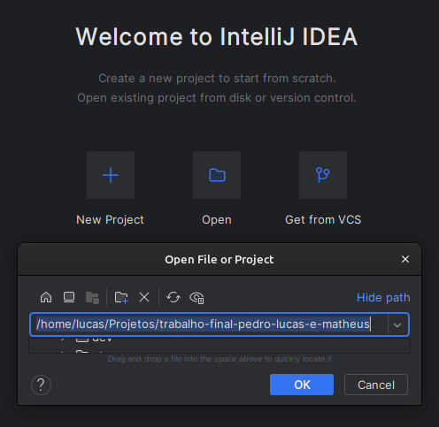
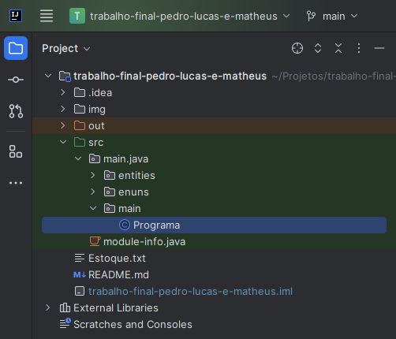

# Projeto de LP2

<h2>Descrição</h2>

O projeto "Simulação de Loja de Instrumentos de Corda" é uma
aplicação que visa reproduzir as funcionalidades de uma loja virtual especializada em instrumentos de corda.

Com um ambiente intuitivo e acessível, a aplicação oferece acesso tanto para clientes em busca de instrumentos musicais quanto para vendedores responsáveis pela gestão do estoque e das vendas.

<h2>Participantes</h2>

* Lucas Emanuel Ribeiro Costa
* Matheus Queiroz de Almeida Pereira
* Pedro Henrique Bastos Viana

## Diagrama de Classes

## Como Executar a aplicação

### No IntelliJ:

<ul>
    <li><h4>Instalar/Copiar a pasta do projeto.</h4></li>
    <li>
            <h4>Abrir a pasta no IntelliJ</h4>
            
    </li>
    <li>
            <h4>Seguir o caminho src/main/java/main/Programa.java</h4>
            
    </li>
    <li>
            <h4>Executar Programa.java</h4>
            
    </li>
</ul>
